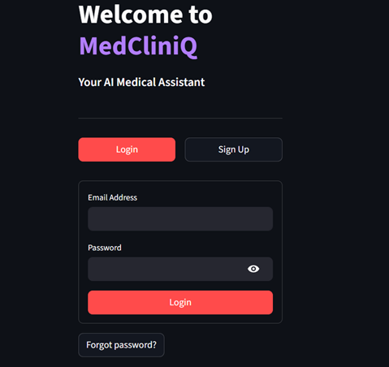
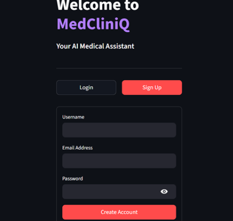
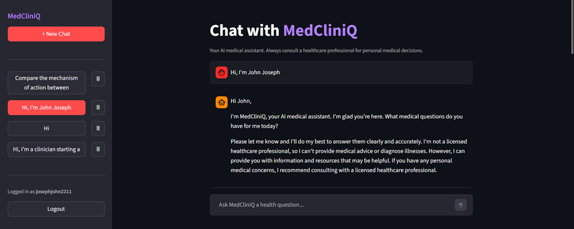
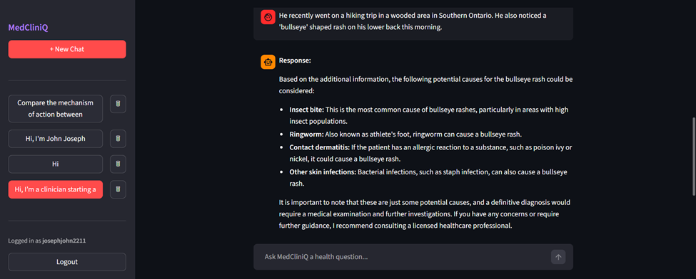
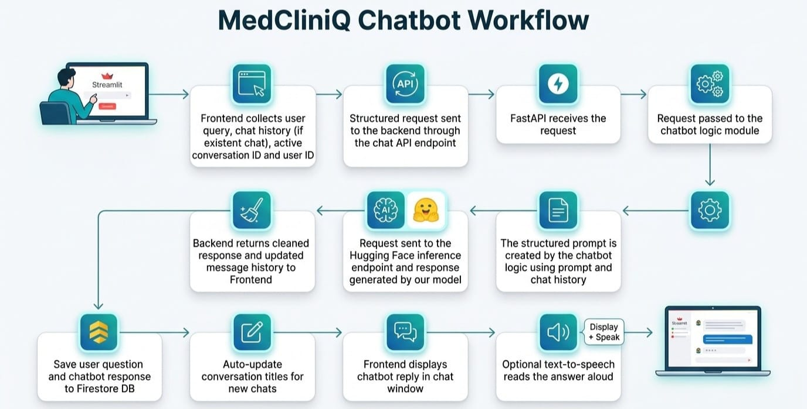
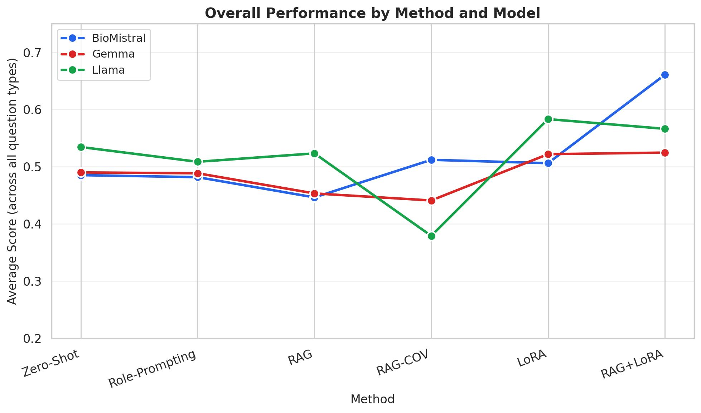
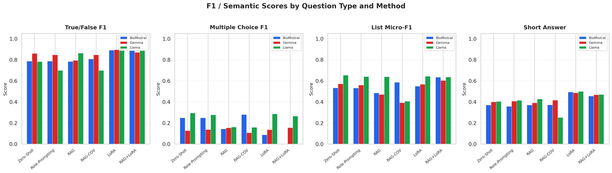

# MedCliniQ

MedCliniQ is an AI medical assistant web app. Users sign in with Firebase, chat through a Streamlit interface, and get answers from a fine-tuned language model hosted on a Hugging Face Inference Endpoint. Conversations are stored in Cloud Firestore.

## Features

- **Authentication** — Email/password sign-up, login, and password reset via Firebase Auth
- **Chat** — Multi-turn conversations with context from recent message history
- **Conversation history** — Sidebar with multiple chats, auto-generated titles, and delete support
- **Text-to-speech** — Optional browser speech synthesis for assistant replies
- **Safety-oriented prompts** — Responses discourage guessing and remind users to consult licensed professionals for personal medical decisions

## Screenshots

### Authentication

<table>
  <tr>
    <td width="50%" align="center">
      <b>Login</b><br>
      
    </td>
    <td width="50%" align="center">
      <b>Sign up</b><br>
      
    </td>
  </tr>
</table>

### Chat interface

**Main chat view** — Sidebar with conversation history, active chat, and medical disclaimer in responses.



**User interaction** — Example health question with assistant reply and text-to-speech control.



### System workflow

End-to-end flow from Streamlit through FastAPI, Hugging Face, and Firestore.



## Benchmarking

MedCliniQ’s underlying models were evaluated on medical Q&A across four task types (true/false, multiple choice, list, and short answer) and six methods: zero-shot, role-prompting, RAG, RAG-CoV, LoRA, and RAG+LoRA. Three base models were compared: BioMistral, Gemma, and Llama.

### Summary

- **Best overall setup:** **BioMistral with RAG+LoRA** reached the highest average score (~0.66). Fine-tuning (LoRA) or combining it with RAG generally improved results more than prompting-only approaches.
- **Strongest task:** **True/false** questions scored highest (often 0.7–0.9), especially with LoRA and RAG+LoRA across all three models.
- **Weakest task:** **Multiple choice** was the hardest category (mostly below 0.3). Llama led this task, while BioMistral dropped sharply under LoRA/RAG+LoRA.
- **Method sensitivity:** **RAG-CoV** helped BioMistral but hurt Llama (large dip to ~0.38 average). **Gemma** was the most stable across methods; **Llama** and **BioMistral** varied more by method.

<table>
  <tr>
    <td width="50%" align="center">
      <b>Overall performance by method</b><br>
      
    </td>
    <td width="50%" align="center">
      <b>F1 scores by question type</b><br>
      
    </td>
  </tr>
</table>

## Architecture

```
Streamlit (frontend.py)  →  FastAPI (api.py)  →  Hugging Face Endpoint
        ↓                           ↓
   Firebase Auth              Firestore (db.py)
```

| Component | Technology |
|-----------|------------|
| UI | [Streamlit](https://streamlit.io/) |
| API | [FastAPI](https://fastapi.tiangolo.com/) + [Uvicorn](https://www.uvicorn.org/) |
| LLM | Hugging Face Inference Endpoint |
| Auth & database | Firebase Auth + Cloud Firestore |

## Prerequisites

- Python **3.13+**
- A [Hugging Face](https://huggingface.co/) account with an Inference Endpoint and API token
- A [Firebase](https://firebase.google.com/) project with:
  - **Authentication** — Email/Password enabled
  - **Cloud Firestore** — Database created
  - A **service account** JSON key for the Admin SDK

## Project structure

```
├── src/
│   ├── api.py              # FastAPI app (/chat)
│   ├── frontend.py         # Streamlit chat UI
│   ├── auth.py             # Login / sign-up screens
│   ├── chat_agent.py       # Prompting, HF calls, response cleanup
│   ├── db.py               # Firestore conversation storage
│   ├── firebase_init.py    # Firebase Admin initialization
│   ├── constants.py        # Environment variable loading
│   └── data_models.py      # Pydantic request/response models
├── requirements.txt
├── pyproject.toml
```

## Setup

### 1. Clone the repository

```bash
git clone git@github.com:zjohnjoseph/MedCliniQ.git
cd MedCliniQ
```

### 2. Create a virtual environment and install dependencies

```bash
python -m venv .venv
.venv\Scripts\activate        # Windows
# source .venv/bin/activate   # macOS / Linux

pip install -r requirements.txt
```

Or with [uv](https://github.com/astral-sh/uv):

```bash
uv sync
```

### 3. Configure environment variables

Create a `.env` file in the project root:

```env
HF_TOKEN=your_huggingface_token
HF_ENDPOINT_URL=https://your-endpoint.endpoints.huggingface.cloud

# Optional generation parameters (defaults shown)
MAX_NEW_TOKENS=512
TEMPERATURE=0.7
TOP_P=0.9
```

### 4. Add Firebase credentials

1. In the Firebase console, go to **Project settings → Service accounts → Generate new private key**.
2. Save the JSON file under `src/` and update the path in `firebase_init.py` if the filename differs.
3. Files matching `src/chatbot-auth*` are gitignored — do not commit service account keys.

Ensure Email/Password sign-in is enabled under **Authentication → Sign-in method**.

## Running the app

MedCliniQ runs as two processes: the API server and the Streamlit UI.

**Terminal 1 — API**

```bash
python -m uvicorn api:app --app-dir src --host 127.0.0.1 --port 8000
```

**Terminal 2 — Frontend**

```bash
streamlit run src/frontend.py
```

Open the URL Streamlit prints (typically `http://localhost:8501`). The frontend calls the API at `http://127.0.0.1:8000/chat`.

## API

| Method | Path | Description |
|--------|------|-------------|
| `POST` | `/chat` | Send a user question and receive an assistant reply |

**Request body**

```json
{
  "question": "What are common symptoms of the flu?",
  "message_history": [
    { "role": "user", "content": "Hello" },
    { "role": "assistant", "content": "Hello! How can I help?" }
  ],
  "conversation_id": "firestore-conversation-id",
  "user_id": "firebase-user-id"
}
```

**Response**

```json
{
  "response": "Assistant reply text",
  "message_history": [ ... ]
}
```

## Firestore data model

```
users/{userId}/conversations/{conversationId}
  ├── title, created_at, updated_at
  └── messages/{messageId}
        └── role, content, timestamp
```

## Disclaimer

MedCliniQ is for informational purposes only. It does not provide medical diagnosis, treatment, or emergency care. Always consult a qualified healthcare professional for personal health decisions.
